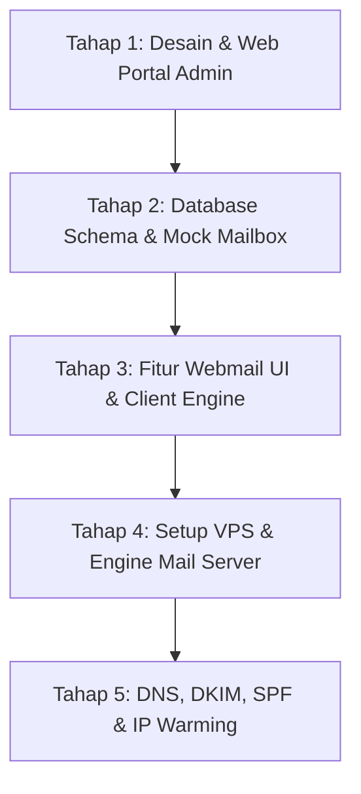

# 📬 Mail Server & Web Portal Roadmap (MailIDS)

> **Panduan Deployment VPS Siap Pakai:** Lihat file [DEPLOYMENT_VPS_GUIDE.md](file:///d:/AI%20Code/mailids/DEPLOYMENT_VPS_GUIDE.md) untuk langkah-langkah lengkap instalasi di VPS Ubuntu production.

Dokumen ini adalah panduan langkah-demi-langkah pengembangan sistem Mail Server Mandiri berbasis Linux (Postfix & Dovecot) dengan antarmuka Web Portal Laravel.
Proses pengembangan dipisahkan menjadi 2 fase besar:
1. **Fase 1: Pengembangan Web Portal & Webmail Lokal (Tanpa VPS)** — *Sedang Berjalan / Siap.*
2. **Fase 2: Instalasi & Integrasi Mail Engine di VPS Linux (Setelah VPS Tersedia)**.

---

## 🚦 Status Legend
- `[ ]` : Belum dikerjakan (Pending)
- `[/]` : Sedang dikerjakan (In Progress)
- `[x]` : Selesai (Completed)

---

## 🎯 Urutan Alur Pengerjaan

---

## 📌 TAHAP 1: Web Portal Admin & UI Foundation (PRIORITAS TERTINGGI 🔥)
> **Tujuan:** Membangun antarmuka dashboard portal web untuk manajemen domain, email accounts, kuota, dan antarmuka webmail sebelum menyentuh server Linux.

### 1.1 Inisialisasi Project & Design System
- [x] **1.1.1** Inisialisasi Project Laravel (versi terbaru) dengan database SQLite/MySQL siap pakai.
- [x] **1.1.2** Setup Arsitektur Livewire SPA dengan `wire:navigate` (navigasi kilat tanpa reload).
- [x] **1.1.3** Implementasi layout modern, responsive, dan dashboard admin (Sidebar, Navbar, Theme dark mode, Stats Cards).
- [x] **1.1.4** Pemisahan Autentikasi Multi-Guard:
  - **Login Admin Portal:** Mengakses konfigurasi server, domain, user, dan DNS (`guard: web`).
  - **Login Webmail Client:** Khusus user mailbox per email domain bisnis (`guard: mailbox` via `virtual_users`).

### 1.2 Skema Database Standar Mail Server (Virtual Mailbox)
*Catatan: Struktur tabel ini 100% kompatibel langsung dengan query Postfix & Dovecot.*
- [x] **1.2.1** Buat Migration tabel `virtual_domains` (id, name, description, is_active, created_at, updated_at).
- [x] **1.2.2** Buat Migration tabel `virtual_users` (id, domain_id, email, name, password, quota_bytes, used_bytes, maildir_path, is_active, created_at, updated_at).
- [x] **1.2.3** Buat Migration tabel `virtual_aliases` (id, domain_id, source_email, destination_email, is_active).
- [x] **1.2.4** Buat Seeder & Factory data dummy untuk testing portal lokal (`VirtualMailSeeder`).

### 1.3 Modul Admin: Manajemen Akun & Domain
- [x] **1.3.1** CRUD Manajemen Domain (`virtual_domains`): Tambah domain, aktifkan/nonaktifkan domain, hapus domain.
- [x] **1.3.2** CRUD Manajemen User Akun Email (`virtual_users`):
  - Form pembuatan email (contoh: `admin@domain.net.id`).
  - Hashing password dengan Bcrypt (standar Dovecot BLF-CRYPT/BCRYPT).
  - Pengaturan kuota penyimpanan email & path Maildir otomatis (`/var/vmail/domain/user/`).
- [x] **1.3.3** CRUD Alias & Forwarding (`virtual_aliases`): Pengalihan email masuk ke akun internal maupun eksternal.
- [x] **1.3.4** Dashboard Analisis: Total akun aktif, kapasitas terpakai, utilisasi storage, status kesiapan Postfix & Dovecot.

---

## 📌 TAHAP 2: Antarmuka Webmail (Inbox, Compose, Sent) (PRIORITAS TINGGI ✉️)
> **Tujuan:** Membangun pengalaman pengguna (UX) webmail mirip Gmail/Outlook langsung di dalam portal.

### 2.1 Desain Antarmuka Webmail (UI/UX)
- [x] **2.1.1** Layout 3-kolom Webmail:
  - Kolom 1: Folder (Kotak Masuk, Terkirim, Drafts, Sampah, Indikator Storage).
  - Kolom 2: Daftar Email (Preview subject, pengirim, waktu, status read/unread, star).
  - Kolom 3: Email Reader View (Full body, detail to/from, date, format pesan).
- [x] **2.1.2** Modal/Page "Compose Email":
  - Form To, CC, BCC, Subject, dan Isi Pesan responsif.
  - Fitur Balas (Reply), Teruskan (Forward), dan Hapus pesan ke Sampah.
  - Simulasi pengiriman terintegrasi ke antrean Postfix & folder Terkirim.
- [x] **2.1.3** Manajemen Folder & Anti-Spam (Hostinger Webmail Style):
  - Kumpulan folder SPAM khusus dengan tombol *Tandai Spam* & *Bukan Spam*.
  - Pembuatan Folder Kustom tak terbatas (contoh: *Klien VIP*, *Tagihan & Invoice*, dll).
  - Pindahkan email ke folder mana pun (*Move to Folder* dropdown di header email).
  - Fitur Pencarian Cepat (*Search*) & Filter Instan (*Belum Dibaca*, *Berbintang*).

### 2.2 Integrasi Service Layer (Protokol IMAP & SMTP)
- [x] **2.2.1** Integrasi library `webklex/laravel-imap` dan publish `config/imap.php`.
- [x] **2.2.2** Buat Service Mail Reader (`App\Services\MailService`) untuk penarikan pesan via IMAP Dovecot.
- [x] **2.2.3** Buat Service Mail Sender (`MailService::sendOutboundMail`) untuk pengiriman via SMTP Postfix.
- [x] **2.2.4** Mock Driver / Testing Lokal: Simulasi interaktif pesan terkirim dan kotak masuk siap pakai.

---

## 📌 TAHAP 3: Infrastruktur & Core Engine Server (PRIORITAS SEDANG ⚙️)
> **Tujuan:** Menyiapkan mesin Linux, database produksi, MTA (Postfix), dan MDA (Dovecot) yang akan dihubungkan ke portal Laravel.

### 3.1 Persiapan VPS & Jaringan
- [ ] **3.1.1** Sewa VPS/Dedicated Server (Ubuntu 22.04/24.04 LTS) dengan Dedicated IP Bersih.
- [ ] **3.1.2** Konfirmasi Port 25 Outbound dibuka oleh provider hosting.
- [ ] **3.1.3** Setup rDNS (PTR Record) IP ke `mail.domain.net.id`.
- [ ] **3.1.4** Konfigurasi Firewall UFW (Buka port 22, 25, 80, 443, 587, 993).

### 3.2 Postfix & Dovecot Setup
- [x] **3.2.1** Buat script konfigurasi Postfix MySQL lookup maps (`scripts/setup-mail-server.sh`).
- [x] **3.2.2** Buat template autentikasi Dovecot MySQL ke database Laravel (`dovecot-sql.conf.ext`).
- [x] **3.2.3** Skrip permission `/var/vmail/` format Maildir siap dieksekusi di VPS.
- [ ] **3.2.4** Pasang Let's Encrypt SSL untuk protokol IMAP/SMTP (`mail.domain.net.id`) di server VPS.
- [ ] **3.2.5** Uji login akun email dari klien pihak ketiga (Thunderbird/Outlook).

---

## 📌 TAHAP 4: Keamanan Email & Reputasi Pengiriman (PRIORITAS PENTING 🛡️)
> **Tujuan:** Memastikan email yang dikirim dari portal tidak masuk ke folder SPAM (Gmail, Yahoo, Microsoft).

### 4.1 DNS Records & DKIM
- [ ] **4.1.1** Konfigurasi OpenDKIM di server Postfix & generate key-pair.
- [x] **4.1.2** Modul Generator & Panduan DNS Record siap di Portal:
  - `A Record` -> `mail.domain.net.id`
  - `MX Record` -> Priority 10 menunjuk ke `mail.domain.net.id`
  - `TXT Record (SPF)` -> `v=spf1 mx a ~all`
  - `TXT Record (DKIM)` -> `default._domainkey.domain.net.id`
  - `TXT Record (DMARC)` -> `v=DMARC1; p=quarantine; rua=mailto:postmaster@domain.net.id`
  - `PTR Record (rDNS)` -> Konfigurasi balik hostname mail server.
- [ ] **4.1.3** Pasang Anti-Spam / Anti-Virus (Rspamd / SpamAssassin).

### 4.2 Verifikasi & Testing
- [x] **4.2.1** Modul Simulator Diagnostik Mail-Tester (Target: 10/10) terpasang di portal.
- [ ] **4.2.2** Uji kirim email ke Gmail dan periksa header email (`SPF: PASS`, `DKIM: PASS`, `DMARC: PASS`) di server live.

---

## 📌 TAHAP 5: Deployment Portal, IP Warming & Go-Live (TAHAP AKHIR 🚀)
- [ ] **5.1** Deploy Web Portal Laravel ke server produksi (di subdomain seperti `portal.domain.net.id` atau `webmail.domain.net.id`).
- [ ] **5.2** Hubungkan Portal Laravel langsung ke database Postfix/Dovecot di localhost.
- [x] **5.3** Jadwal & Rencana IP Warming (Terintegrasi panduan bertahap di modul DNS Helper).
- [x] **5.4** Setup automated backup command (`php artisan mail:backup`) untuk konfigurasi virtual mailbox.
- [x] **5.5** Antarmuka Monitoring Log Real-Time (`/var/log/mail.log`) siap di Web Portal.
